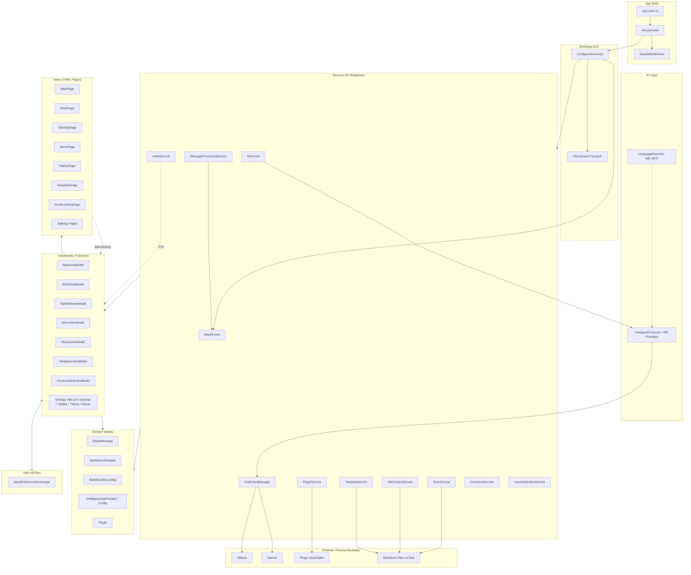

# Collox — Architecture

> Generated from the GitNexus knowledge graph (1409 symbols, 3324 relationships, 100 functional areas, 46 execution flows).

Collox is a **WinUI 3 desktop writing/chat application** (Windows-only, `net10.0-windows10.0.26100.0`) that pairs a multi-tab markdown editor with pluggable AI backends (Ollama / OpenAI), text-to-speech, a template system, and an embedded **Model Context Protocol (MCP)** server. Plugins are loaded dynamically from external assemblies.

The architecture follows **MVVM** (CommunityToolkit.Mvvm), **manual DI** in `App.xaml.cs`, **Serilog** logging, and **weak-reference messaging** between ViewModels.

---

## 1. High-Level Architecture



**Layer responsibilities**

| Layer | Responsibility | Lifetime |
|---|---|---|
| `App.xaml.cs` | Process entry, DI registration, window setup | — |
| **Services** (`Collox/Services/`) | Side-effectful orchestration: I/O, AI calls, plugin loading, notifications | Singleton |
| **ViewModels** (`Collox/ViewModels/`) | UI state, commands, inter-VM messaging | Transient |
| **Views** (`Collox/Views/`) | XAML pages; bind only to ViewModels | Page-scoped |
| **Models** (`Collox/Models/`) | Plain data + a few factories (e.g. `IChatClientFactory`) | Per-use |
| **AI** (`Collox/AI/`) | ML.NET language detection (training, consumption, evaluation) | Static |
| **Mcp** (`Collox/Mcp/`) | MCP tool definitions exposed by `McpService` | Singleton |
| **Common** (`Collox/Common/`) | `AppConfig`, `AppHelper`, `Constants`, value converters, `MessageTemplateSelector`, `QueueTransport` | Mixed |
| **T4Templates** | Build-time C# generation for navigation and breadcrumb mappings | Generated |

---

## 2. Functional Areas (Knowledge-Graph Clusters)

The knowledge graph resolves **100 Leiden communities**, which collapse into the following high-level areas. Top clusters by symbol count:

| Area | Top clusters (symbols) | Purpose |
|---|---|---|
| **ViewModels** | 4 clusters (10, 7, 7, 5+5+5+4+3+2) | All page-level state holders and commands; largest area of the codebase |
| **Services** | 11+ clusters (11, 9, 8, 7, 6×6, 5, 4×4, 3×3, 2×9) | Each service cluster groups a related interface + implementation (e.g. `IAudioService` + `AudioService`); also includes the AI processor and message-processing subsystems |
| **Settings** | 4 clusters (12, 8, 5, 2+2) | AI, general, update, theme, about-us settings — split between VMs and views |
| **Models** | 2 clusters (5, 3) | Domain types: `SingleMessage`, `MarkdownTemplate`, `MarkdownRecording`, `IntelligenceApiProvider`, `IntelligenceConfig`, `Plugin`, `IChatClientFactory`, `ConversationContribution` |
| **Views** | 3 clusters (5, 2, 2) | Top-level XAML pages; settings subfolder has its own grouping |
| **AI** | 3 clusters (5, 4, 2) | ML.NET language detection — training, consumption, evaluation |
| **Messages** | 1 cluster (2) | `WeakReferenceMessenger` payload types (see table below) |
| **Converters** | 1 cluster (8) | XAML value converters under `Common/Converters/` |
| **Collox root** | 2 clusters (7, 2) | `App.xaml.cs`, `ErrorWindow`, `GlobalUsings`, app entry bootstrap |
| **Collox.Api** | 1 cluster (2) | Plugin contract project — `IPlugin`, `IApiProvider`, `ConnectionInfo`, `PluginAttribute` |
| **UnitTests** | 2 clusters (14, 7) | MSTest + Moq + NFluent tests (ViewModel-only) |
| **Common / Cluster_16/19** | small | `AppConfig`, `AppHelper`, `Constants`, `MessageTemplateSelector`, `QueueTransport` |

### Inter-VM Messages

Located in `Collox/ViewModels/Messages/`:

- `TextSubmittedMessage` — fired when the user submits text in a write tab
- `UpdateTabMessage` — request to update a tab's state
- `FocusTabMessage`, `FocusInputMessage` — UI focus requests
- `GetFrameRequestMessage` — retrieve a `Frame` from the shell
- `MessageSelectedMessage` — a message was selected in history/mirror
- `TaskDoneMessage` — a background task completed
- `TemplateAddedMessage`, `TemplateEditedMessage`, `TemplateDeletedMessage` — template CRUD notifications
- `ProcessorDeletedMessage`, `ApiProviderDeletedMessage` — AI configuration changes

### Services Inventory

| Service | Interface | Responsibility |
|---|---|---|
| `AIService` | `IAIService` | Load/manage `IntelligentProcessor`s; resolve per-provider chat client |
| `ChatClientManager` | `IChatClientManager` | Cache and list available models for the active provider |
| `StoreService` | `IStoreService` | Append/save markdown conversations to disk; filename resolution |
| `TabContextService` | `ITabContextService` | Persist and notify tab state |
| `TemplateService` | `ITemplateService` | CRUD markdown templates and resolve filenames |
| `MessageProcessingService` | `IMessageProcessingService` | Core message pipeline (create comment, create task, modify message) — calls into MCP |
| `McpService` | `IMcpService` | Hosts the embedded MCP server; exposes tools to the AI |
| `PluginService` | `IPluginService` | Two-phase dynamic load of plugin assemblies via `PluginLoadContext` |
| `AudioService` | `IAudioService` | TTS playback for `ColloxMessage` |
| `CommandService` | `ICommandService` | Slash-command processing; builds `CommandContext` |
| `UserNotificationService` | `IUserNotificationService` | Toast notifications; updates notification tray |

---

## 3. Key Execution Flows

The knowledge graph resolved **46 execution flows** (processes). The five most architecturally significant are traced below, ordered by step count then architectural centrality.

### 3.1 `Submit → GenerateCurrentFilename` (7 steps, 3 communities)

The core **write** flow: user submits text, it is added as a message, persisted, and a filename is generated for the markdown file.

| # | Step | File | Kind |
|---|---|---|---|
| 1 | `WriteViewModel.Submit` | `Collox/ViewModels/WriteViewModel.cs` | VM entry |
| 2 | `WriteViewModel.AddTextMessage` | `Collox/ViewModels/WriteViewModel.cs` | VM |
| 3 | `WriteViewModel.PersistMessageIfEnabled` | `Collox/ViewModels/WriteViewModel.cs` | VM |
| 4 | `StoreService.Append` | `Collox/Services/StoreService.cs` | Service |
| 5 | `StoreService.Save` | `Collox/Services/StoreService.cs` | Service |
| 6 | `StoreService.CheckFilename` | `Collox/Services/StoreService.cs` | Service |
| 7 | `StoreService.GenerateCurrentFilename` | `Collox/Services/StoreService.cs` | Service terminal |

**Why it matters**: Spans the ViewModel → Service boundary and is the only 7-step process in the codebase. Demonstrates the canonical "VM calls service, service owns I/O" pattern.

### 3.2 `InitializeAsync → GetAvailableModelsAsync` (5 steps, 2 communities)

**AI Settings** initialization — when the user opens AI settings, processors and models are enumerated.

| # | Step | File |
|---|---|---|
| 1 | `AISettingsViewModel.InitializeAsync` | `Collox/ViewModels/Settings/AISettingsViewModel.cs` |
| 2 | `AIService.GetAllProcessors` | `Collox/Services/AIService.cs` |
| 3 | `AIService.InitializeProcessors` | `Collox/Services/AIService.cs` |
| 4 | `ChatClientManager` | `Collox/Services/ChatClientManager.cs` |
| 5 | `ChatClientManager.GetAvailableModelsAsync` | `Collox/Services/ChatClientManager.cs` |

**Why it matters**: Shows the **AI service chain** — a Settings VM touches `AIService`, which fans out to the `ChatClientManager` that actually queries the provider (Ollama / OpenAI).

### 3.3 `LoadTabs → GetAvailableModelsAsync` (5 steps, 2 communities)

**Tab context** startup — when the tab list loads, each tab's AI provider is initialized and its models are listed.

| # | Step | File |
|---|---|---|
| 1 | `TabWriteViewModel.LoadTabs` | `Collox/ViewModels/TabWriteViewModel.cs` |
| 2 | `AIService.GetAllProcessors` | `Collox/Services/AIService.cs` |
| 3 | `AIService.InitializeProcessors` | `Collox/Services/AIService.cs` |
| 4 | `ChatClientManager` | `Collox/Services/ChatClientManager.cs` |
| 5 | `ChatClientManager.GetAvailableModelsAsync` | `Collox/Services/ChatClientManager.cs` |

**Why it matters**: Identical AI chain to §3.2, but reached from a different VM — confirms `AIService` is the single funnel for processor initialization across the app.

### 3.4 `OnLaunched → SetupMainWindow` (3 steps, 1 community)

**Application startup** — the only path that creates the main window.

| # | Step | File |
|---|---|---|
| 1 | `App.OnLaunched` | `Collox/App.xaml.cs` |
| 2 | `App.HandleNotification` | `Collox/App.xaml.cs` |
| 3 | `App.SetupMainWindow` | `Collox/App.xaml.cs` |

**Why it matters**: The `App.OnLaunched` → `HandleNotification` → `SetupMainWindow` chain also runs on notification activation (the `NotificationManager_NotificationInvoked` process reuses `SetupMainWindow`).

### 3.5 `ConfigureServices → McpService` (3 steps, 1 community)

**DI bootstrap** — the only place services are wired up.

| # | Step | File |
|---|---|---|
| 1 | `App.ConfigureServices` | `Collox/App.xaml.cs` |
| 2 | `McpService.CreateAsync` | `Collox/Services/McpService.cs` |
| 3 | `McpService` (registration) | `Collox/Services/McpService.cs` |

**Why it matters**: The MCP server is constructed **asynchronously at startup** (not lazily), so it is reachable as soon as the UI is shown. The same `ConfigureServices` step also registers `ClientQueueTransport` (for IPC) and every other singleton service.

### Other notable flows (architectural cross-references)

- **`Submit → Append`** (4 steps) — same write path as §3.1, terminating at `IStoreService.Append` (the interface contract).
- **`Submit → SingleMessage`** (4 steps) — the message-construction sub-flow, terminating in the `SingleMessage` model constructor.
- **`Submit → TextColloxMessage` / `ColloxMessageComment`** (3 steps) — message polymorphic creation.
- **`Submit → ProcessCommandAsync`** (3 steps) — slash-command path through `ICommandService`.
- **`Receive → SaveTabs`** (4 steps) — Messenger-driven tab save (`TabWriteViewModel.Receive` consumes a message and triggers `TabContextService.SaveTabs`).
- **`AddNewTab → SaveTabs`** (3 steps) — user-driven tab creation, persists immediately.
- **`ContextBox_OnPreviewKeyDown → SaveTabs`** (4 steps) — view-driven save (View → ViewModel via code-behind).
- **`LoadPluginsAsync → PluginLoadContext` / `Plugin`** (3 steps) — plugin assembly loading.
- **`Refresh → DependencyInfo` / `GetPublicKeyToken`** (4 steps) — home landing diagnostic data.
- **`OnProviderChanged → GetAvailableModelsAsync`** (3 steps) — settings re-fetch on provider switch.
- **`Train → BuildPipeline`** (3 steps) — ML.NET language detection training.
- **`PredictAllLabels → GetLabels`** (3 steps) — ML.NET inference at runtime.

---

## 4. Cross-Cutting Concerns

### Dependency Injection

Manual in `App.ConfigureServices` (no generic host). Convention: **services are singletons, ViewModels are transient**, accessed via `App.GetService<T>()`. The `QueueTransport` (client variant) is also registered as a singleton for IPC between the app and its MCP server.

### Inter-VM Messaging

`CommunityToolkit.Mvvm.Messaging.WeakReferenceMessenger` is the only pub/sub bus. Payloads live in `Collox/ViewModels/Messages/` and are immutable records. Key producer/consumer pairs:

- `TabWriteViewModel.Receive` ← `UpdateTabMessage`, `FocusTabMessage`, etc.
- `WriteViewModel.SendTextSubmittedMessage` → `TextSubmittedMessage`
- `TemplatesViewModel` → `TemplateAddedMessage` / `TemplateEditedMessage` / `TemplateDeletedMessage`
- `MainViewModel.InitAsync` → `UserNotificationService.UpdateUserNotifications`

### T4 Code Generation

`Collox/T4Templates/NavigationPageMappings.tt` and `BreadcrumbPageMappings.tt` are run by Visual Studio's `TextTransform.exe` to emit the navigation and breadcrumb glue. The generated `.cs` files are committed and **must** be regenerated when pages are added — the navigation system will silently misroute otherwise.

### Plugin System

`Collox.Api` defines the contract (`IPlugin`, `IApiProvider`, `ConnectionInfo`, `PluginAttribute`). `Collox/Services/PluginService.cs` uses `PluginLoadContext` (a custom `AssemblyLoadContext`) to load plugin assemblies in two phases: first discover and load assemblies, then call `Initialize` on each `IPlugin`. The `HelloPlugin` project is the reference example.

### Logging

Serilog (file, console, debug sinks) is bridged to `Microsoft.Extensions.Logging` and consumed by ViewModels via `ILogger<T>`.

---

## 5. Module Dependency Direction

```
Views ──► ViewModels ──► Services ──► Models
   ▲           │             │
   │           ▼             ▼
   └─────  Messenger    External (Ollama, OpenAI, Filesystem, Plugins, MCP tools)
```

- **Views** depend only on **ViewModels** (data binding + code-behind for view events like `OnPreviewKeyDown`).
- **ViewModels** depend on **Services** (constructor-injected via `App.GetService<T>()`) and on **Models** for data shapes.
- **Services** depend on **Models** and on external APIs (HTTP, filesystem, plugin assemblies). They never reference ViewModels.
- **Cross-VM** coordination uses **Messages** (no direct VM-to-VM references).
- **App.xaml.cs** is the composition root; it is the only file that knows about every layer.

This keeps the layers testable in isolation: `UnitTests/` constructs ViewModels with Moq'd services and asserts behavior without spinning up a WinUI window.
